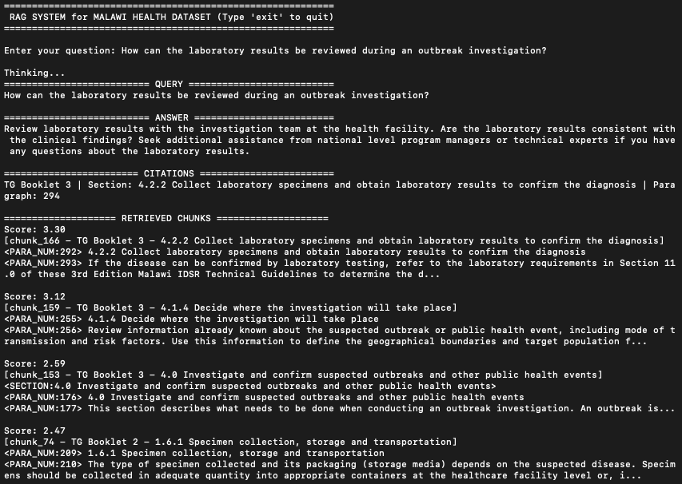

# Malawi IDSR Public Health RAG System

Retrieval-Augmented Generation (RAG) system designed to query the Malawi Integrated Disease Surveillance and Response (IDSR) Technical Guidelines. 

This system features structure-aware chunking, hybrid retrieval (Vectors + BM25), Cross-Encoder reranking, and exact paragraph-level citation tracking using the Llama 3 model via Ollama.

---

## Prerequisites

* **Python**: 3.11+
* **Ollama**: Installed and running locally (v0.23.1+ recommended).

### 1. Install and Start Ollama

1. Download Ollama from: https://ollama.com/download
2. Verify the installation by opening your terminal and running:
   ```bash
   ollama --version
   ```
   *You should see something like: `ollama version 0.x.x`*
3. Start the Ollama server:
   ```bash
   ollama serve
   ```

### 2. Pull the llama3 model

1. Open a new terminal window and pull the correct model:
   ```bash
   ollama pull llama3
   ```
2. Verify the model installed successfully:
   ```bash
   ollama list
   ```
   *You should see `llama3` in the list of available models.*

### 3. Install Python Dependencies

Create a virtual environment (recommended) and install the dependencies.

```bash
pip install -r requirements.txt
```
---

## Usage

The application is run via `app.py` and offers two main modes: `--interactive` and `--demo`. 

If the hybrid index does not exist, the system will automatically ingest the Excel files and build the index on the first run.

### 1. Interactive Mode
Launch an interactive chatbot CLI where you can ask public health questions:
```bash
python app.py --interactive
```

### 2. Demo Mode
Run a batch of 10 pre-defined queries (including test questions that require the model to abstain):
```bash
python app.py --demo
```

### 3. Trace Mode (Debugging)
To see exactly which chunks were retrieved and their Cross-Encoder relevance scores, append the `--trace` flag to either mode:
```bash
python app.py --interactive --trace
```

### 4. Force Rebuilding the Index
If you update the dataset or tweak the chunking logic in `ingest.py`, use the `--rebuild` flag to force the system to delete the old index and build a new one:
```bash
python app.py --interactive --rebuild
```

---

## Sample (Interactive trace mode)


